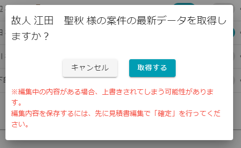

# 本部で変更された情報を取り込みたい  

葬儀の施行中に本部にて変更された葬儀情報を取り込むには次の手順で取り込みます.

## 手順
1. 施行中案件一覧のを選択します   
※施行中案件の表示の仕方は[こちら](../../funeral_list/yet/#1) をご確認ください. 
 
 

2. 本操作を行う確認画面が表示されるので**[取得する]**を選択します   
 
 

## 注意点
- 上記の操作を行うと、本部に送信していなかった入力データが消えてしまいます．プラン変更などで本部に葬儀情報を変更してもらう際には、**必ず今まで入力した情報を本部に送信**してください.  
入力した情報を本部に送信する方法はFAQの"[入力した情報を本部に連携したい](../push_data)"をご確認ください. 