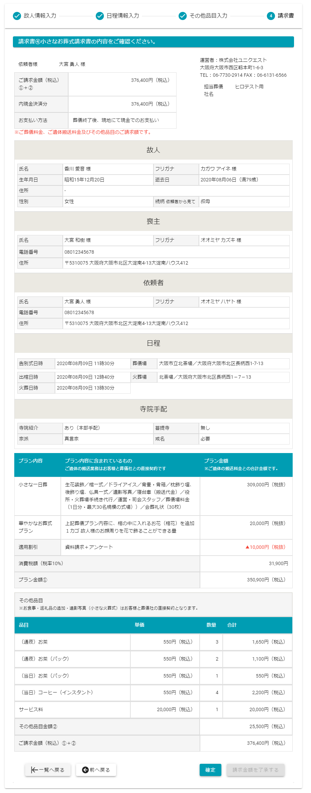

# 入力した情報を本部に連携したい  

各ステータスの操作時に本部へ葬儀データを連携する方法を記載しています.

## 『お迎』ステータスの時  
お迎え時間入力画面の**[入力完了]**ボタン押下で、設定したお迎え時間情報を本部へと送信します.  
 
 

## 『見積』ステータスの時  
見積内容確認の画面にある**[確定]**ボタン押下で、入力した見積情報を本部へと送信します.  
 
 

## 『請求』ステータスの時  
請求内容確認の画面にある**[確定]**ボタン押下で、入力した請求情報を本部へと送信します.  
 
 

