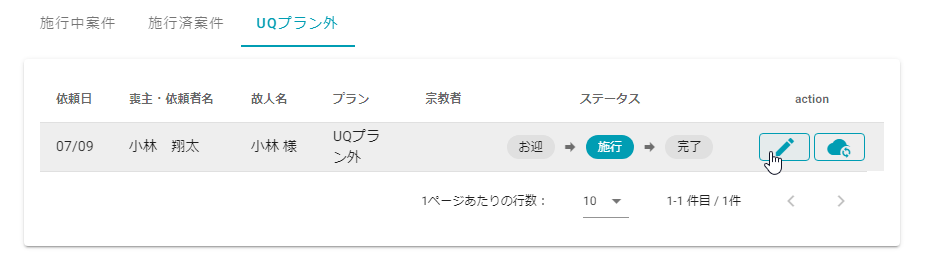
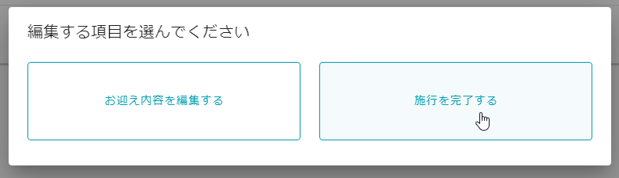

# UQプラン外

小さなお葬式本部から送客されたお客様で**UQプラン以外**を希望した葬儀に関して、本部では**施行情報（見積書や請求書）の管理はしていません**. **葬儀社様が用意した見積書・請求書**をご使用ください.  
本プランは、お客様の情報の確認とお迎え日時の設定、施行が完了しているかどうかだけを管理します.  

## 1.「UQプラン外」の種類  
- 搬送
- 骨葬
- 葬祭扶助（お別れ葬）
- 葬祭扶助（火葬式）
- その他

 
## 2. お客様の情報の確認とお迎え日時の設定  
通常プランの[ステータス『お迎』](../omukae/)と同じです.   
※参照する一覧は**UQプラン外**です.  
※UQプラン外の表示の仕方は[こちら](../../funeral_list/not_UQ_plan/#1) をご確認ください. 

## 3. 施行の完了  
1. UQプラン外一覧のを選択します.   
   

2. **[施行を完了する]**を選択します.  
    
 以上で葬儀の施行管理の操作が終わりました.  
 一覧のデータを見るとステータスが**完了**となっているのが確認できます.