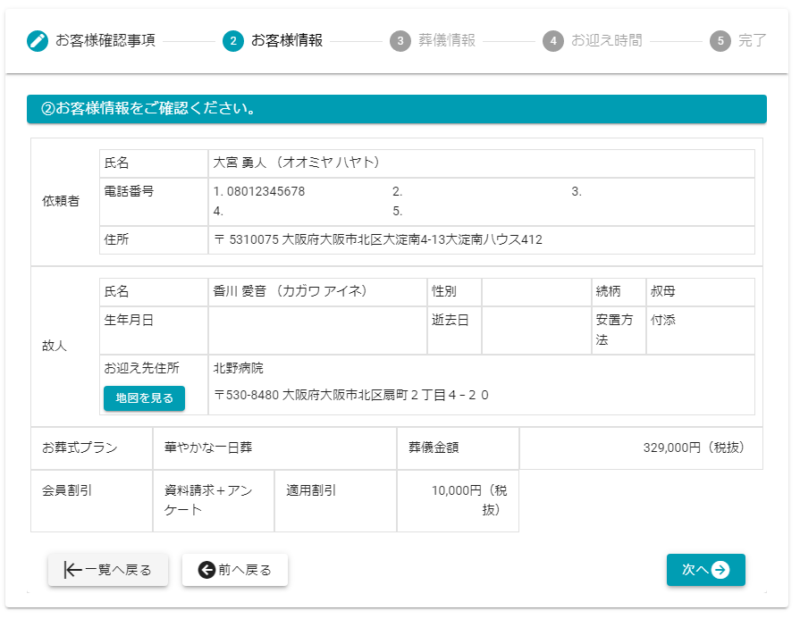

# ステータス - お迎 - 

小さなお葬式本部から送客されたお客様情報の確認と、お迎え日時の設定を行います.

## 1. 葬儀の詳細画面を表示する  
1. 施行中案件一覧のを選択します.  
 
 
※施行中案件の表示の仕方は[こちら](../../funeral_list/yet/#1) をご確認ください. 

2. **[お迎え内容を編集する]**を選択します.  
 
 
   

  
## 2. お客様情報の確認とお迎え日時を設定する
### 1. お客様確認事項  
小さなお葬式本部から葬儀を行う葬儀社に対し、お客様の葬儀についての特記事項を表示しています.  
**必ず読む**ようにお願いします.
 

### 2. お客様情報  
お客様から依頼いただいた内容を表示しています.
 

### 3. 葬儀情報  
お客様が予定されている葬儀情報を表示しています.
 

### 4. お迎え時間  
お客様のところへ伺う（お迎え）時間を入力します.  
※検視などで未定の場合、仮日時を入力してください.
 

### 5. 完了  
   
 以上で葬儀のお迎えの操作が終わりました.  
 **[一覧へ戻る]**ボタンより施行一覧に戻りますと、ステータスが**見積**に変わっています.  
 また、一覧の担当者欄にご自身の担当者名が設定されています.