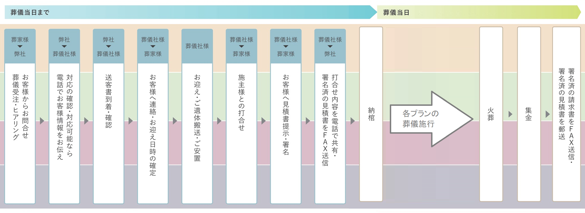
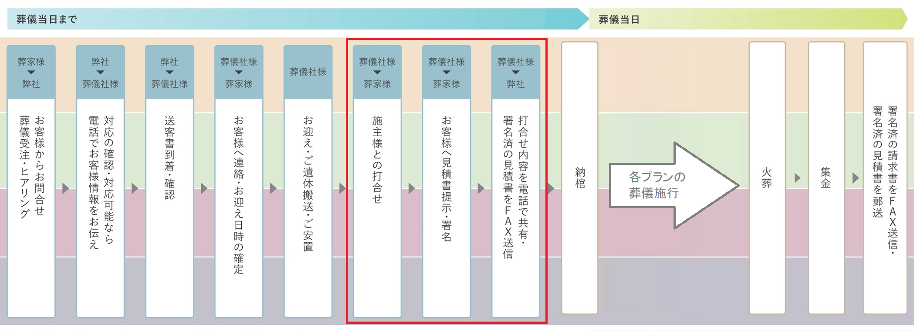

# 葬儀の流れと本システム

 
  
小さなお葬式の葬儀の施行は上記の流れで行われています．  
本システムは、３つのステータスでこの施行を管理していきます.

## ステータス１. 『お迎』
このステータスでは、最初の「送客書到着・確認」と「お客様へ連絡・お迎え日時の確定」の２つを管理します.  
 
 

## ステータス２. 『見積』
このステータスでは、「施主様との打合せ」と「お客様へ見積書提示・署名」、「見積書をFAX送信」の３つを管理します.  
 
 

## ステータス３. 『請求』
このステータスでは、最後の「請求書をFAX送信」を管理します.  
 
 

