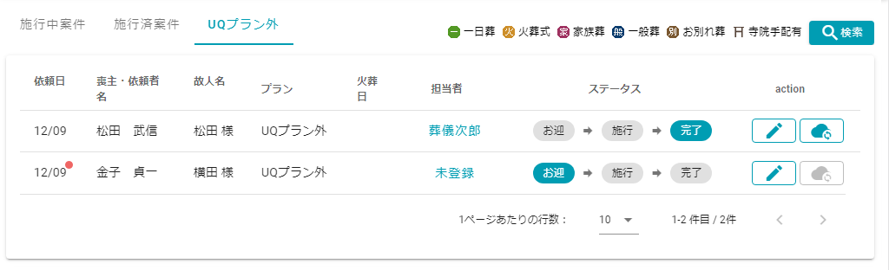

# UQプラン外

小さなお葬式本部から送客されたお客様で**UQプラン以外**を希望した葬儀の一覧を表示しています.

 
 

## 1. 表示の仕方  
施行中案件から表示します.　施行中案件の表示の仕方は[こちら](../yet/#1) をご確認ください.   

1. **[UQプラン外]**を選択します.   
 
 
  

  
## 2. 各項目の説明

|||
|:---------|------------------:|
|依頼日|小さなお葬式本部でお客様から葬儀のご依頼を受けた日付です. **赤丸**がついているデータは小さなお葬式本部から新規に送客された葬儀を示しています.|
|喪主・依頼者名|葬儀をご依頼した方のお名前または、喪主様のお名前です. どちらも情報が登録されている場合には、喪主様のお名前を表示します.|
|故人名|お亡くなりになった方のお名前（苗字のみ）です.|
|プラン・宗教者|施行する葬儀のプランと葬儀にて宗教者（お坊さんや神主、聖職者）をお呼びするかどうかです.|
|火葬日|葬儀の火葬日です.|
|担当者|葬儀を担当している人の担当者名です. 表示されている担当者名もしくは「未登録」を選択して担当者を設定及び変更ができます.|
|ステータス|葬儀の進捗状況です.|
||ステータスを進めるために葬儀データの確認・編集を行います.|
||小さなお葬式本部で保持されている葬儀データの最新情報を取得します.|