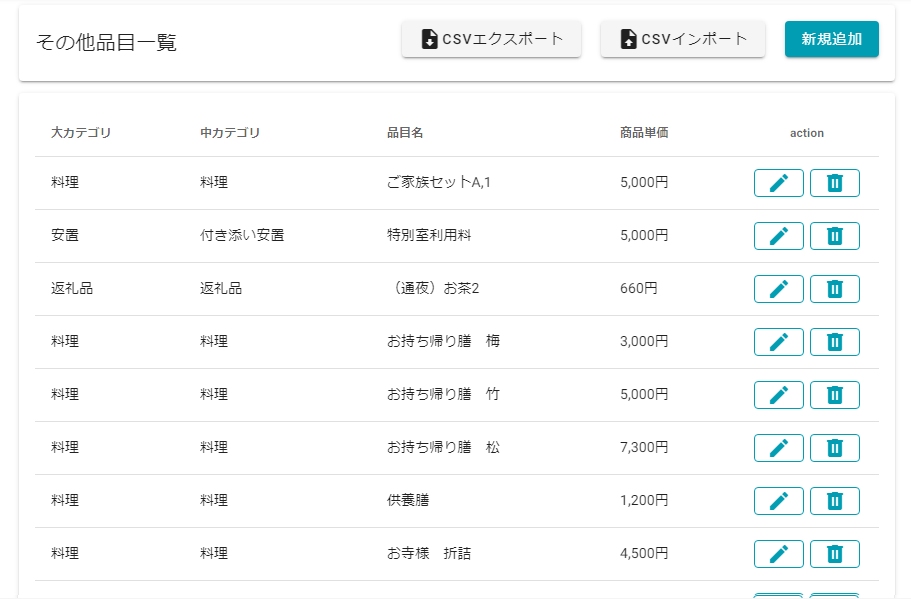
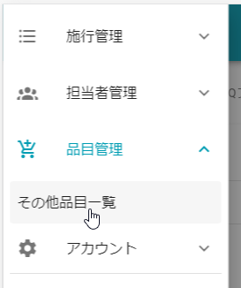
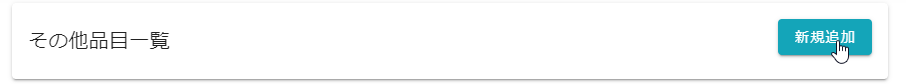
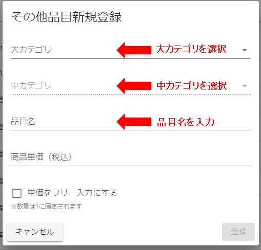
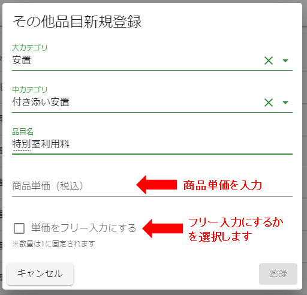
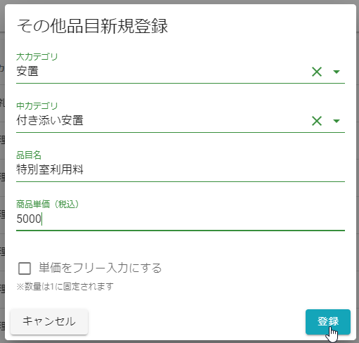
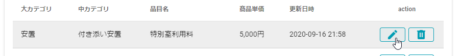
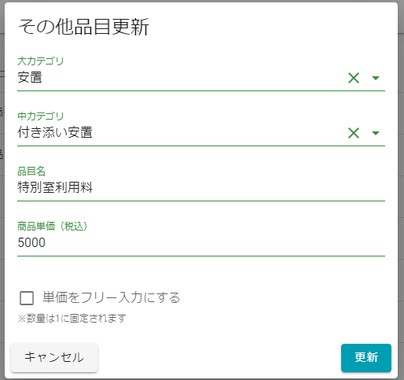
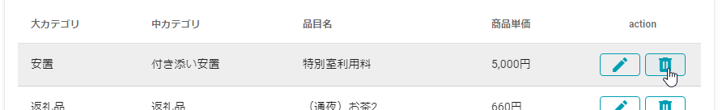
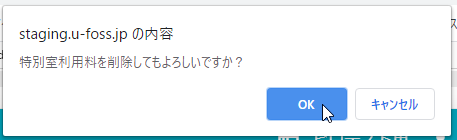

# その他品目情報

葬儀のその他品目データを管理するための画面です.  
 
 

##　表示方法
1. **[メニュー]**を開きます.  
 
 

2. **[その他品目一覧]**を選択します.  
 
 

## 新規追加  
1. **[新規追加]**を選択します.  
 
 
  

2. 追加したい品目の**大カテゴリ**と**中カテゴリ**、**品目名**を入力します.   
 
 
  

3. **商品単価**と**フリー入力にするか**を設定します.  
※フリー入力をチェックONにした場合、葬儀追加品目の設定で金額を自由に入力できますが、数量は「1」固定になります.  
 
 
  

4. **[登録]**をクリックします.  
 
  
 
## 編集  
1. **[編集]**を選択します.  
 
 

2. 変更したい項目を修正し、**[更新]**をクリックします.  
 
 

## 削除  
品目の削除は、**直近40日以内の案件で利用されていない**ものだけ削除できます.  
1. **[削除]**を選択します.  
 
 

2. 確認のポップアップが表示されるので、**[OK]**を選択します.  
 
 

  
