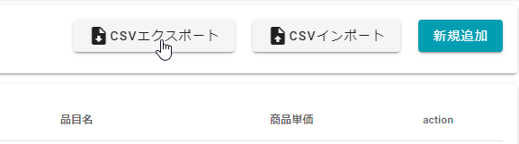
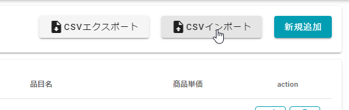
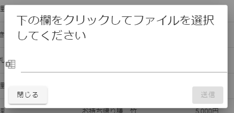
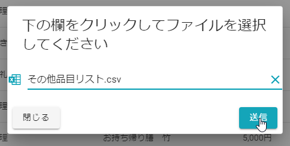

# その他品目情報

葬儀のその他品目データを管理するための画面です.  
 
 

##　表示方法
1. **[メニュー]**を開きます.  
 
 

2. 品目管理 > **[その他品目一覧]**を選択します.  
 
 

## 新規追加  
1. **[新規追加]**を選択します.  
 
 
  

2. 追加したい品目の**大カテゴリ**と**中カテゴリ**、**品目名**を入力します.   
 
 
  

3. **商品単価**と**フリー入力にするか**を設定します.  
※フリー入力をチェックONにした場合、葬儀追加品目の設定で金額を自由に入力できますが、数量は「1」固定になります.  
 
 
  

4. **[登録]**をクリックします.  
 
  
 
## 編集  
1. **[編集]**を選択します.  
 
 

2. 変更したい項目を修正し、**[更新]**をクリックします.  
 
 

## 削除  
品目の削除は、**直近40日以内の案件で利用されていない**ものだけ削除できます.  
1. **[削除]**を選択します.  
   
  
2. 確認のポップアップが表示されるので、**[OK]**を選択します.  
 
 

## CSVエクスポート  
登録されている全ての品目情報をCSVファイルで出力します.  
1. **[CSVエクスポート]**を選択します.  
 
 

### フォーマット  
CSVインポートに使用できるようにインポート用CSVファイルに合わせた書式になっています.  

|項目|説明|
|----|----|
|品目ID|本システムで管理している管理IDです.|
|大カテゴリ名|品目の大カテゴリの名称です.|
|中カテゴリ名|品目の中カテゴリの名称です.|
|品目名|品目の名称です.|
|単価（税込）|品目データの単価です. 数値で出力しており「￥」や「円」といった記号や単位は省略して表示します.|
|単価フリー入力|単価がフリー入力の品目について「1」と表示します.|
|削除|CSVインポートで利用する項目です.空欄で出力されます.|
 

## CSVインポート  
CSVからその他品目情報を一括で登録、変更、削除します.  
1. **[CSVインポート]**を選択します.  
 
 
2. 確認のポップアップが表示されるので、CSVファイルを設定します.  
 
 
3. **[送信]**を選択しCSVインポートします.  
 
 

### フォーマット

|項目|書式|説明|例|
|----|----|----|--|
|品目ID|半角数字|本システムで管理している管理IDを設定します. **新規登録する場合は、空欄**に設定します.|ex. 123|
|大カテゴリ名|文字列|品目の大カテゴリの名称を設定します. 設定できる大カテゴリの名称は[大カテゴリと中カテゴリ](#_9)をご確認ください.|ex. 安置|
|中カテゴリ名|文字列|品目の中カテゴリの名称を設定します. 設定できる中カテゴリの名称は[大カテゴリと中カテゴリ](#_9)をご確認ください.|ex. 預かり安置|
|品目名|文字列|品目の名称を設定します.|ex. 安置室使用料|
|単価（税込）|半角数字|品目データの単価を設定します.**税込み**の金額を設定してください.|ex. 1100|
|単価フリー入力|「1」または空欄|葬儀データに設定する時に金額部分を入力したい場合は「1」を設定し、それ以外は空欄にしてください.|ex. 1|
|削除|「1」または空欄|登録されているその他品目データを削除したい場合に「1」を設定し、それ以外は空欄にしてください.|ex. 1|
 

#### 注意点  
- ファイルの拡張子は「csv」になります.
- CSVファイルの1行目はヘッダー行になりますので、インポートするデータは2行目から設定してください.
- CSVファイルのデータは1列目から順に上記の項目としてインポートしますので項目の順番に気を付けてください.

 

### 大カテゴリと中カテゴリ  
大カテゴリと中カテゴリの組み合わせ一覧です.

|大カテゴリ|中カテゴリ|
|---------|----------|
|料理|料理|
|返礼品|返礼品|
|返礼品|会葬礼状追加|
|安置|預かり安置|
|安置|付き添い安置|
|安置|自宅安置／ドライアイス|
|処置|エンバーミング|
|処置|古式湯灌|
|処置|普通湯灌|
|処置|ラストメイク|
|処置|納棺の儀|
|処置|納体袋|
|処置|消臭剤|
|処置|防水シーツ|
|処置|検案・検死・介添料|
|花・供物・祭壇|枕花|
|花・供物・祭壇|祭壇花追加分|
|花・供物・祭壇|棺内に入れる花|
|花・供物・祭壇|供花|
|花・供物・祭壇|花輪|
|花・供物・祭壇|灯篭（回転灯篭・提灯含む）|
|花・供物・祭壇|盛篭（お菓子・果物・酒）|
|花・供物・祭壇|祭壇ランクアップ|
|花・供物・祭壇|樒（しきみ）|
|花・供物・祭壇|供養膳|
|花・供物・祭壇|神式大ぬさ|
|花・供物・祭壇|寺院用供物|
|車|搬送距離追加|
|車|寝台車|
|車|霊柩車|
|車|マイクロバス|
|車|ハイヤー|
|車|タクシー|
|車|高速代|
|車|搬送回数追加|
|車|深夜料金追加|
|火葬場・式場|火葬料金|
|火葬場・式場|火葬場控え室|
|火葬場・式場|式場控え室|
|火葬場・式場|式場差額|
|火葬場・式場|寝具一式|
|スタッフ|式スタッフ増員|
|スタッフ|警備員|
|スタッフ|配膳係|
|スタッフ|司会者 (プロ)|
|写真|遺影写真|
|写真|手札写真|
|物品|骨壷骨箱ランクアップ・追加|
|物品|棺ランクアップ|
|物品|塔婆|
|物品|野位牌|
|物品|六文銭|
|物品|副葬品|
|物品|座布団・椅子|
|物品|後飾りランクアップ|
|物品|焼香セット|
|物品|収骨セット|
|物品|看板|
|物品|白装束 (ランクアップ)|
|宗教儀式|玉串追加|
|宗教儀式|献花追加|
|宗教儀式|神式後飾り|
|サービス|配膳奉仕料|
|サービス|貸衣装|
|サービス|サービス料|
|サービス|埋葬サービス|
|サービス|訃報代|
|その他|花 (無料オプション)|
|その他|供物 (無料オプション)|
|その他|仏衣 (無料オプション)|
|その他|その他|
