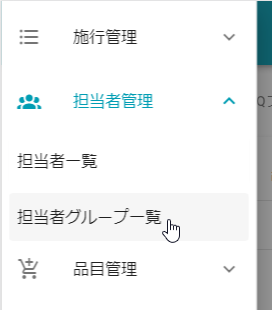

# 担当者グループ情報

U-FOSSを利用するユーザをグループ管理するための画面です.  
グループの各操作については管理者権限が必要となります.   

## 担当者グループの機能について
- グループに所属しているユーザは、同じグループに所属する担当者の葬儀データ、もしくはまだ担当者が割り当てられていない葬儀データのみ閲覧することができます.
- どのグループにも所属しないユーザは、すべての葬儀データを閲覧することができます.
- ユーザは複数のグループに所属することができます. その場合、施行一覧の絞り込み機能でグループごとの葬儀データを絞り込むことができます.
- 作成できるグループ数およびグループに所属できるユーザ数の制限はありません.

##　表示方法
1. **[メニュー]**を開きます.  
   
    

2. **[担当者グループ一覧]**を選択します.  
   登録されているグループ数が多い場合は、左右の **＜＞矢印アイコン** で左右にスクロールすることができます.  
   
    

## グループの新規追加
1. **[新規追加]**を選択します.  
   
    

2. 追加したいグループの**名前**を入力し、**[登録]**をクリックします.
   
    

## グループの編集
1. **[編集]**アイコンを選択します.  
   
    

2. 変更したい項目を修正し、**[更新]**をクリックします.
   
    

## グループの削除
1. **[削除]**アイコンを選択します. グループに所属しているユーザがいる場合は、グループを削除することはできません.  
   
    

2. 確認のポップアップが表示されるので、**[OK]**を選択します.  
   
    

## グループへのユーザの追加
1. **[新規追加アイコン]** を選択します.  
   
    

2. 追加したいユーザをチェックボックスで選択し、**[完了]**をクリックします.
   
    

## グループからのユーザの削除
1. ユーザ名右側の **[削除アイコン]**を選択します.  
   
    

2. 確認のポップアップが表示されるので、**[OK]**を選択します.  
   
    