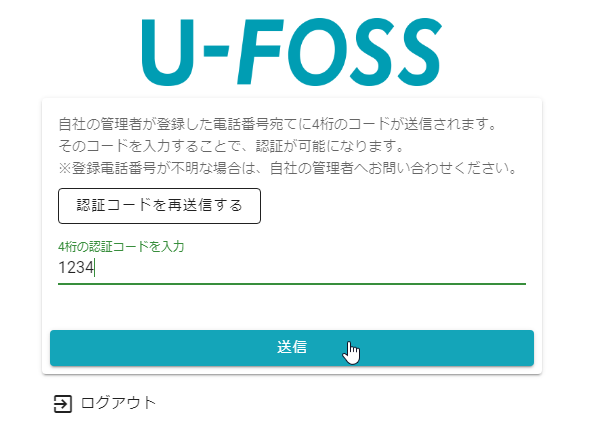

# 担当者情報

U-FOSSを利用するユーザを管理するための画面です.  
 
 

##　表示方法
1. **[メニュー]**を開きます.  
 
 

2. 担当者管理 > **[担当者一覧]**を選択します.  
 
 

## 新規追加  
1. **[新規追加]**を選択します.  
 
 
  

2. 追加したいユーザの**名前**と**名前（カナ）**、**電話番号**を入力します.   
※電話番号は**携帯の電話番号**を推奨.   
※名前は見積書作成時の担当者として利用されます.  
 
 
  

3. **メールアドレス**と**パスワード**、**権限**を設定します.  
※個人情報を扱うシステムなので、**二段階認証の設定は原則ONにする**ようにしてください．  
※メールアドレスとパスワードはU-FOSSにログインするのに利用されるので、**他の人と同じメールアドレスは設定できません**.  
 
 
  

4. **[登録]**をクリックします.  
 
 
登録したメールアドレス宛てに作成したユーザのログイン情報が送られます．  
 
## 編集  
1. **[編集]**を選択します.  
 
 

2. 変更したい項目を修正し、**[更新]**をクリックします.  
※パスワードは、この画面では変更できません.  
 
 

## 削除  
1. **[削除]**を選択します.  
 
 

2. 確認のポップアップが表示されるので、**[OK]**を選択します.  
 
 

## パスワード初期化  
パスワード初期化は、パスワードを忘れてしまったユーザに一時パスワードを発行します.  
一時パスワードを発行してもらったユーザはそのパスワードでログインし、ログイン後にパスワードを再設定します.  

1. **[PW初期化]**を選択します.  
 
 

2. 一時パスワードを入力します.  
 
 

3. **[初期化]**を選択します.  
 
   
以上で入力した一時パスワードに初期化されました.  
画面の指示に従い担当者へ案内してください.  
 
 

## 権限について  
### 権限の種類  
|     |    |
|:----|---:|
|管理者|本システムのすべてのユーザを管理できます。また、本システムの機能についてもすべての機能が利用できます|
|事務|事務処理を行う方向けの権限です.|
|営業|お客様のもとに行き、葬儀の施行を行う方向けの権限です.|

### 権限と機能  
|      |管理者|事務|営業|
|:-----|---- |----|---:|
|ユーザの一覧閲覧           |〇|〇|〇|
|ユーザ作成・削除           |〇|✕|✕|
|ユーザ情報の変更           |〇|〇（自分のみ）|〇（自分のみ）|
|ユーザグループの一覧閲覧           |〇|〇|〇|
|ユーザグループ作成・削除           |〇|✕|✕|
|ユーザグループの変更、ユーザの追加・削除           |〇|✕|✕|
|パスワードの初期化         |〇|✕|✕|
|その他品目の一覧閲覧        |〇|〇|〇|
|その他品目作成・削除        |〇|✕|✕|
|その他品目情報の変更        |〇|✕|✕|
|その他品目情報のCSVインポート |〇|✕|✕|
|見積書・請求書のダウンロード|〇|〇|〇|
|案件（施行）情報の閲覧・変更|〇|〇|〇|
|葬儀社情報の変更        |〇|✕|✕|
|アカウントロック設定の変更        |〇|✕|✕|

## 二段階認証について  
### 二段階認証とは  
ログインする場合に「IDとパスワード」の認証をおこなった後に、さらに指紋やSMSなどでもう一度認証をおこなうことをいいます.  
つまり、一度ではなく「二度の認証を行うこと」を二段階認証と呼びます.  

### 本システムの二段階認証  
本システムでは、SMSを利用しています.
登録された電話番号宛てにSMSが送られ、送信内容ある4桁のコードが認証キーとなります.  
また本システムの二段階認証はログインする度におこなうものではなく、1度二段階認証でログインした後は、しばらくの間、「IDとパスワード」の認証のみでログインできます.  
 

## アカウントロックについて  
特定のユーザのU-FOSSへのログインを停止する場合にアカウントにロックをかけてログインできないように設定できます.  
また、ログインを何度か失敗すると自動的にそのアカウントにロックがかかるので、ロックされたアカウントのロック解除もおこなえます.
