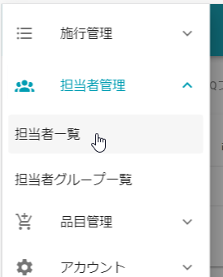
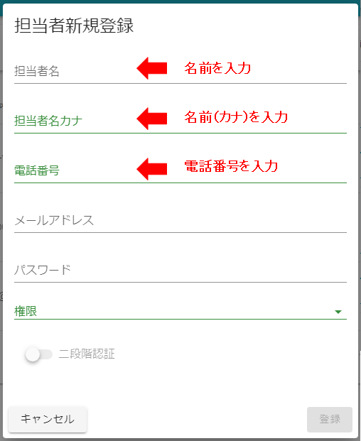
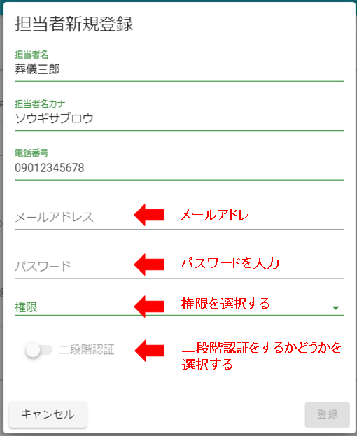
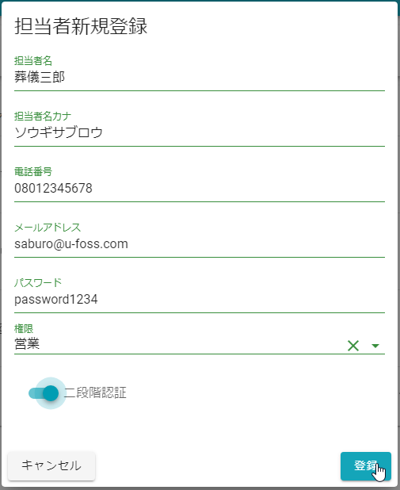
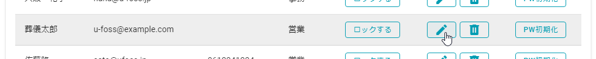
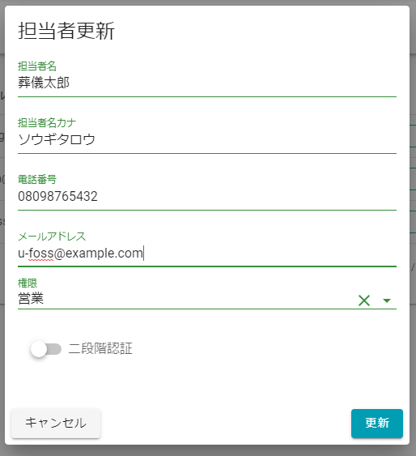
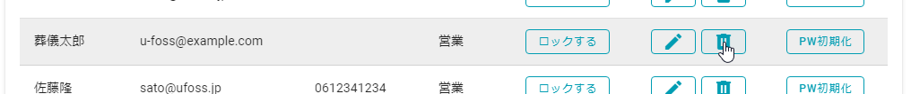
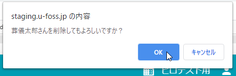
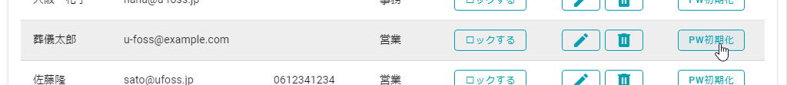

# 担当者情報

U-FOSSを利用するユーザを管理するための画面です.  
 
 

##　表示方法
1. **[メニュー]**を開きます.  
 
 

2. **[担当者一覧]**を選択します.  
 
 

## 新規追加  
1. **[新規追加]**を選択します.  
 
 
  

2. 追加したいユーザの**名前**と**名前（カナ）**、**電話番号**を入力します.   
電話番号は**携帯の電話番号**を推奨。 
※名前は見積書作成時の担当者として利用されます.  
 
 
  

3. **メールアドレス**と**パスワード**、**権限**を設定します.  
※個人情報を扱うシステムなので、二段階認証の設定は原則ONにするようにしてください．  
※メールアドレスとパスワードはU-FOSSにログインするのに利用されるので、**他の人と同じメールアドレスは設定できません**.  
 
 
  

4. **[登録]**をクリックします.  
 
 
登録したメールアドレス宛てに作成したユーザのログイン情報が送られます．  
 
## 編集  
1. **[編集]**を選択します.  
 
 

2. 変更したい項目を修正し、**[更新]**をクリックします.  
※パスワードの欄は**パスワードを変更したい**ときだけ入力します.  
 
 

## 削除  
1. **[削除]**を選択します.  
 
 

2. 確認のポップアップが表示されるので、**[OK]**を選択します.  
 
 

## パスワード初期化  
パスワード初期化は、パスワードを忘れてしまったユーザに一時パスワードを発行します.  
一時パスワードを発行してもらったユーザはそのパスワードでログインし、ログイン後にパスワードを再設定します.  

1. **[PW初期化]**を選択します.  
 
 

2. 一時パスワードを入力します.  
 
 

3. **[初期化]**を選択します.  
 
   
以上で入力した一時パスワードに初期化されました.  
画面の指示に従い担当者へ案内してください.  
 
 

## 権限について  
### 権限の種類  
|     |    |
|:----|---:|
|管理者|本システムのすべてのユーザを管理できます。また、本システムの機能についてもすべての機能が利用できます|
|事務|事務処理を行う方向けの権限です.|
|営業|お客様のもとに行き、葬儀の施行を行う方向けの権限です.|

### 権限と機能  
|      |管理者|事務|営業|
|:-----|---- |----|---:|
|ユーザの一覧閲覧           |〇|〇|〇|
|ユーザ作成・削除           |〇|✕|✕|
|ユーザ情報の変更           |〇|〇（自分のみ）|〇（自分のみ）|
|パスワードの初期化         |〇|✕|✕|
|見積書・請求書のダウンロード|〇|〇|〇|
|案件（施行）情報の閲覧・変更|〇|〇|〇|
